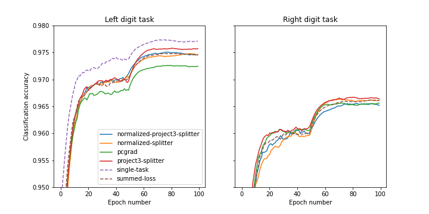

## Usage

```python
from multitask_splitter import NormalizedMultiTaskSplitter

task_weight_dict = {"task_1": 1.0, "task_2": 1.0}
splitter = NormalizedMultiTaskSplitter(task_weight_dict)

for x in dataloader:
    x = base_model(x)
    feature_dict = splitter(x) # identity in the forward pass but combines gradients in the backward pass.
    loss1 = loss_model1(feature_dict["task_1"])
    loss2 = loss_model2(feature_dict["task_2"])
    loss = loss1 + loss2
    loss.backward()
    ... # can be used with any pytorch optimizer

```

## How does it work

**1) Gradient normalization:** The first trick is to normalization gradients similarly as in Meta's multitask normalizer [2].
An important difference is that it's implemented here with a custom `autograd.Funcion` to override the backward pass.
This enables splitting gradients anywhere in the computational graph unlike with Defossez's implementation.
In short each gradient is normalization using:
```python
def backward(grads, m): # pseudo-code summary of GradientNormalizer(...)
    m = beta * m + (1-beta) * grads.square().sum(-1) # momentum of the gradient norms
    v = m / (1 - torch.pow(beta,t) # unbiased momentum formula
    return grads / v.sqrt().clip(min=epsilon) * loss_coeff # return the sclaed gradient
```

**2) Gradient projection:** Inspired by pcgrad [1,3] we also tried to project the gradients onto each other.
This is disabled by default because it has been disappointing.
```python
def backward(gradient_list): # pseudo-code summary of MultiTaskSplitter(...)
    
    # randomize loss order if there is no priority
    if random_order: 
        g_list = [gradient_list[i] for i in torch.randperm(n)]

    for i in range(n):
        g_i = g_list[i]
        for j in range(n if use_symmetric else i):
            # make sure that g_i always has zero scalar product with g_list[j] for j < i
            g_i = truncated_proj_a_on_b(g_i, g_list[j])

        projected_g_list += [g_i]
    return sum(projected_g_list)
```


## Results on Mulit-MNIST:
Two digits are plotted and the two tasks are to classify digits 1 and 2.
The dataloader is debugged from the [Pytorch-PCGrad repo](https://github.com/WeiChengTseng/Pytorch-PCGrad.git) and we compare our results to their implementations of pcgrad.  

<b>Preliminary results:</b> Two digits (left and right) are overlapping on an image.
The image is processed with a LeNet ConvNet to produce features. The feature vector is then sent into two MLPs to compute classification cross entropy losses for the left and right digit respectively.

  
<b>Figure 1. Left:</b> Classification accuracy for the left digit (averaged over 3 independent runs), the x-axis is the epoch number. 
<b>Right:</b> Classification accuracy for the right digit.


  
  
<b> Figure 2.</b> Same as Figure 1, but without the re-weighted of the loss functions, there are already balanced and the normalization has a weaker effect.

## References


[1] Gradient Surgery for Multi-Task Learning  
Tianhe Yu, Saurabh Kumar, Abhishek Gupta, Sergey Levine, Karol Hausman, Chelsea Finn  
https://arxiv.org/abs/2001.06782


[2] High Fidelity Neural Audio Compression  
Alexandre Défossez, Jade Copet, Gabriel Synnaeve, Yossi Adi  
https://arxiv.org/abs/2210.13438  

[3] Unofficial pytorch pcgrad repo [github.com/WeiChengTseng/Pytorch-PCGrad.git](https://github.com/WeiChengTseng/Pytorch-PCGrad.git)