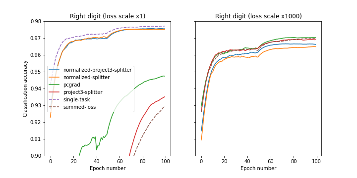

## Multi-task splitter
**A simple deep learning solution for multitask in PyTorch.**  

You can copy-paste the standalone file `splitter.py` or clone the repo and do `pip install .`  
The main class is Splitter class is used as follows:

```python
from torchmultitask.splitter import NormalizedMultiTaskSplitter

# set the weight of each task, no need to take into account the different scales of the loss function.
# typically 1.0 is a one-size-fits-all that avoids fine-tuning the loss weights (weights between 0.1 and 10 can be tried out, to prioritize one loss)
task_weight_dict = {"task_1": 1.0, "task_2": 1.0}
splitter = NormalizedMultiTaskSplitter(task_weight_dict)

for x in dataloader:
    x = base_model(x)
    x_dict = splitter(x)  # identity in the forward pass but normalizes and project gradients in the backward pass.  
    loss1 = loss_model1(x_dict["task_1"])
    loss2 = loss_model2(x_dict["task_2"])
    loss = loss1 + loss2
    loss.backward()
    ...  # can be used with any pytorch optimizer

```

## How does it work

**1) Gradient normalization:** The first trick is to normalization gradients similarly as in Meta's multitask normalizer [3].
An important difference is that it's implemented here with a custom `autograd.Funcion` to override the backward pass.
This enables splitting gradients anywhere in the computational graph unlike with Meta's implementation [(here)](https://github.com/facebookresearch/encodec).
In short each gradient is normalization using:
```python
def backward(grads, m):
    # pseudo-code summary of GradientNormalizer(...) in gradient_normalizer.py
    # the NormalizedMultiTaskSplitter(...) in splitter.py does it on all tasks simultaneously to go faster
    m = beta * m + (1-beta) * grads.square().mean(0).sum() # momentum of the gradient norms, mean on batch dimension
    v = m / (1 - torch.pow(beta,t) # unbiased momentum formula
    return grads / v.sqrt().clip(min=epsilon) * loss_coeff # return the scalaed gradient
```

**2) Gradient projection:** Inspired by pcgrad [1,4] and this nice paper [2] we also tried to project the gradients onto each other.
This is disabled by default because it slows down the training a bit (by ~20%, still faster that the pytorch implementation [3]) in some cases it might improve performance.


## Results on Multi-MNIST:
Two digits are plotted and the two tasks are to classify digits 1 and 2.
This is similar to the toy multi-task problem considered in [2].
The dataloader is debugged from the [Pytorch-PCGrad repo](https://github.com/WeiChengTseng/Pytorch-PCGrad.git) and we compare our results to their implementations of pcgrad.  

  

<b>Demo on Multi MNIST:</b> Two digits (left and right) are overlapping on an image.
The image is processed with a LeNet ConvNet to produce features. The feature vector is sent into two MLPs to compute classification cross entropy losses for the left and right digit respectively.

  
<b>Figure 1. Left:</b> Classification accuracy for the left digit (averaged over 3 independent runs), the x-axis is the epoch number. 
<b>Right:</b> Classification accuracy for the right digit.


  
  
<b> Figure 2.</b> Same as Figure 1, but without the re-weighted of the loss functions, there are already balanced and the normalization has a weaker effect.

## References

Cite this repo:
```bibtex
@misc{bellec2023,
  author = {Bellec, G},
  title = {Multi-task splitter: A simple deep learning solution for multitask in PyTorch},
  year = {2023},
  journal = {GitHub repository},
  howpublished = {\url{https://github.com/guillaumeBellec/multitask}}
}
```

Related references:


[1] [Gradient Surgery for Multi-Task Learning (pcgrad)](https://arxiv.org/abs/2001.06782)  
Tianhe Yu, Saurabh Kumar, Abhishek Gupta, Sergey Levine, Karol Hausman, Chelsea Finn  

[2] [Multi-Task Learning as Multi-Objective Optimization](https://proceedings.neurips.cc/paper_files/paper/2018/file/432aca3a1e345e339f35a30c8f65edce-Paper.pdf)  
Ozan Sener, Vladlen Koltun  


[3] [High Fidelity Neural Audio Compression](https://arxiv.org/abs/2210.13438)  
Alexandre Défossez, Jade Copet, Gabriel Synnaeve, Yossi Adi  
  

[4] Unofficial pytorch pcgrad repository    
[github.com/WeiChengTseng/Pytorch-PCGrad.git](https://github.com/WeiChengTseng/Pytorch-PCGrad.git)